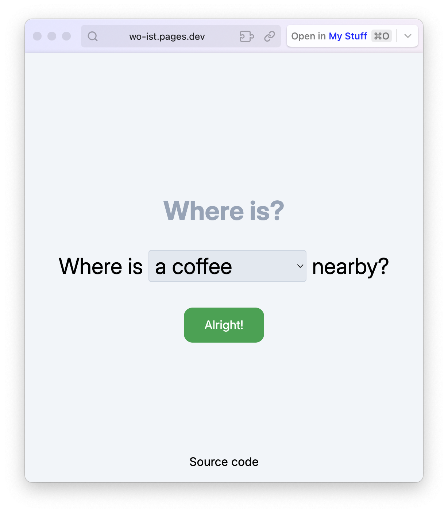

# Wo ist?

An small app to quickly find local amenities, such as ATMs, toilets or Kebab stands.



## Run it yourself

This project requires [pnpm](https://pnpm.io/). Install it before proceeding with the steps below.

### Step 1: Installing dependencies

```sh
pnpm install
```

### Step 2: Build the project

```sh
pnpm run build
```

### Step 3: Run it

```sh
node build
```
